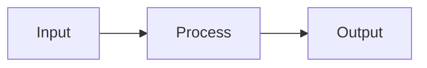

# Copilot Instructions for Presentation Tools

| Version | Date | Author | Description |
| --- | --- | --- | --- |
| 1.0.0 | 2026-01-15 | Elix Team | Initial Copilot behavior configuration |

## Project Context

This is a **Presentation Tools** project designed to help students create academic presentations and documents efficiently using:
- **VS Code** as the primary editor
- **GitHub Copilot** for AI-assisted writing
- **Markdown** for content structure
- **Marp** for slide generation

## Copilot Behavior Guidelines

### Language Rules

- **Code comments and documentation**: English
- **Content for presentations/reports**: Follow user's language preference (Vietnamese or English)
- **Academic tone**: Formal, clear, concise

### Content Generation

When generating content for slides or documents:

1. **Structure First**: Always suggest proper heading hierarchy
2. **Bullet Points**: Keep bullets concise (max 10 words per point)
3. **Speaker Notes**: Include detailed explanations in HTML comments
4. **Visual Suggestions**: Recommend diagrams using MermaidJS when appropriate

### Slide-Specific Rules

When working with Marp-enabled Markdown:

```markdown
---
marp: true
theme: default
paginate: true
---

# Slide Title

- Point 1
- Point 2

<!-- Speaker notes go here -->
```

### Code Block Conventions

- Always specify language for syntax highlighting
- Use appropriate languages: `python`, `javascript`, `bash`, etc.
- For pseudocode, use `plaintext` or `algorithm`

### Diagram Generation

Prefer MermaidJS for diagrams:



## File Naming Conventions

| Type | Format | Example |
| --- | --- | --- |
| Presentation | `TOPIC_presentation.md` | `ai_project_presentation.md` |
| Report | `TOPIC_report.md` | `thesis_report.md` |
| Template | `template_TYPE.md` | `template_academic.md` |
| Prompt | `prompt_PURPOSE.md` | `prompt_structure.md` |

## Quality Checklist

Before finalizing any content, ensure:

- [ ] Clear heading hierarchy (H1 > H2 > H3)
- [ ] No orphan bullets (single bullet under a heading)
- [ ] Consistent formatting throughout
- [ ] Speaker notes for complex slides
- [ ] Visual aids where appropriate
