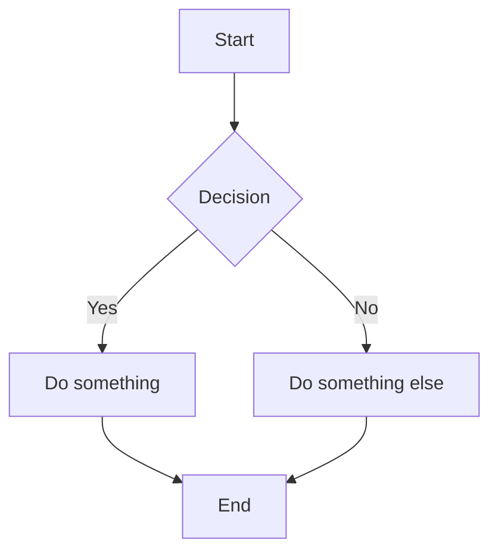
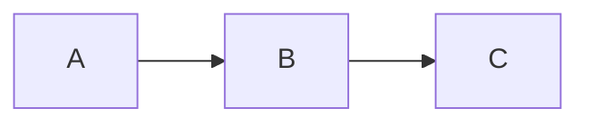
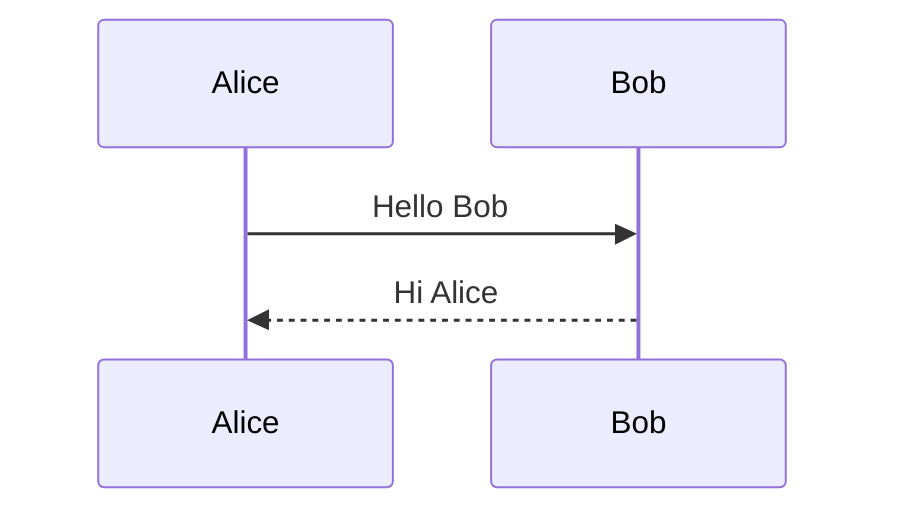
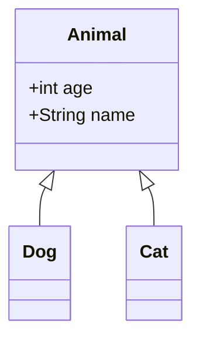
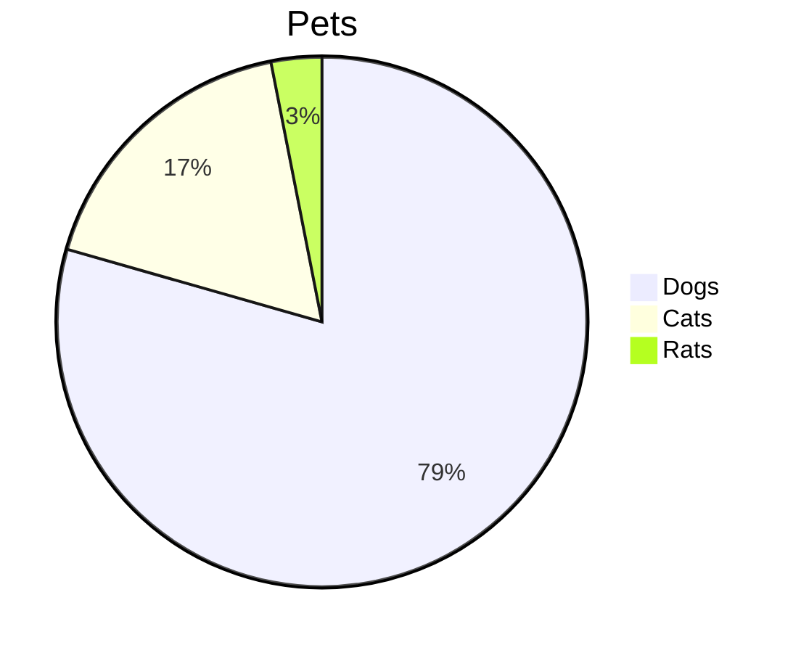

# Hướng Dẫn Markdown Cơ Bản - Markdown Basics

| Version | Date | Author | Description |
| --- | --- | --- | --- |
| 1.0.0 | 2026-01-15 | Elix Team | Complete Markdown guide for beginners |

## Table of Contents

1. [Markdown Là Gì?](#1-markdown-là-gì)
2. [Cú Pháp Cơ Bản](#2-cú-pháp-cơ-bản)
3. [Cú Pháp Nâng Cao](#3-cú-pháp-nâng-cao)
4. [Marp-Specific Syntax](#4-marp-specific-syntax)
5. [Best Practices](#5-best-practices)
6. [Cheat Sheet](#6-cheat-sheet)

---

## 1. Markdown Là Gì?

### Định Nghĩa

**Markdown** là ngôn ngữ đánh dấu (markup language) đơn giản để định dạng văn bản. Thay vì click các nút như trong Word, bạn dùng các ký tự đặc biệt.

### Tại Sao Dùng Markdown?

| Word/PowerPoint | Markdown |
| --- | --- |
| Click chuột để format | Gõ ký tự để format |
| Khác nhau giữa các phiên bản | Luôn giống nhau |
| File nặng (.docx, .pptx) | File nhẹ (.md) |
| Khó version control | Dễ dùng với Git |

### File Markdown

- Đuôi file: `.md` hoặc `.markdown`
- Mở bằng: VS Code, Notepad, bất kỳ text editor
- Export ra: PDF, HTML, DOCX, Slides

---

## 2. Cú Pháp Cơ Bản

### 2.1. Headings (Tiêu Đề)

```markdown
# Heading 1 (Tiêu đề lớn nhất)
## Heading 2
### Heading 3
#### Heading 4
##### Heading 5
###### Heading 6 (Tiêu đề nhỏ nhất)
```

**Kết quả:**

# Heading 1
## Heading 2
### Heading 3

**Quy tắc:**
- Luôn có dấu cách sau `#`
- Không nhảy level (H1 → H3, bỏ qua H2)

---

### 2.2. Text Formatting (Định Dạng Chữ)

```markdown
**Bold** hoặc __Bold__
*Italic* hoặc _Italic_
***Bold và Italic***
~~Strikethrough~~
`Inline code`
```

**Kết quả:**

- **Bold**
- *Italic*
- ***Bold và Italic***
- ~~Strikethrough~~
- `Inline code`

---

### 2.3. Lists (Danh Sách)

#### Unordered List (Không thứ tự)

```markdown
- Item 1
- Item 2
  - Sub-item 2.1
  - Sub-item 2.2
- Item 3

* Cũng dùng được dấu *
+ Hoặc dấu +
```

**Kết quả:**

- Item 1
- Item 2
  - Sub-item 2.1
  - Sub-item 2.2
- Item 3

#### Ordered List (Có thứ tự)

```markdown
1. First item
2. Second item
3. Third item
   1. Sub-item 3.1
   2. Sub-item 3.2
```

**Kết quả:**

1. First item
2. Second item
3. Third item
   1. Sub-item 3.1
   2. Sub-item 3.2

#### Task List (Danh sách công việc)

```markdown
- [x] Completed task
- [ ] Incomplete task
- [ ] Another task
```

**Kết quả:**

- [x] Completed task
- [ ] Incomplete task
- [ ] Another task

---

### 2.4. Links (Liên Kết)

```markdown
[Text hiển thị](https://example.com)

[Google](https://google.com)

[Link đến file khác](./other-file.md)

[Link đến section](#heading-name)
```

**Kết quả:**

[Google](https://google.com)

---

### 2.5. Images (Hình Ảnh)

```markdown


{width=50%}
```

**Lưu ý:**
- `Alt text` mô tả hình ảnh (cho accessibility)
- Đường dẫn có thể relative hoặc absolute
- Nên đặt hình trong thư mục `images/` hoặc `hinh_anh/`

---

### 2.6. Blockquotes (Trích Dẫn)

```markdown
> Đây là một đoạn trích dẫn.
> Có thể nhiều dòng.

> Trích dẫn cấp 1
>> Trích dẫn cấp 2
>>> Trích dẫn cấp 3
```

**Kết quả:**

> Đây là một đoạn trích dẫn.
> Có thể nhiều dòng.

---

### 2.7. Code Blocks (Khối Code)

#### Inline Code

```markdown
Dùng hàm `print()` để in ra màn hình.
```

**Kết quả:** Dùng hàm `print()` để in ra màn hình.

#### Code Block

````markdown
```python
def hello():
    print("Hello, World!")
```
````

**Kết quả:**

```python
def hello():
    print("Hello, World!")
```

#### Các Ngôn Ngữ Phổ Biến

| Language | Identifier |
| --- | --- |
| Python | `python` |
| JavaScript | `javascript` hoặc `js` |
| Java | `java` |
| C/C++ | `c`, `cpp` |
| HTML | `html` |
| CSS | `css` |
| SQL | `sql` |
| Bash/Shell | `bash`, `shell` |
| JSON | `json` |
| YAML | `yaml` |
| Plain text | `plaintext` |

---

### 2.8. Horizontal Rule (Đường Kẻ Ngang)

```markdown
---

***

___
```

**Kết quả:**

---

---

## 3. Cú Pháp Nâng Cao

### 3.1. Tables (Bảng)

```markdown
| Header 1 | Header 2 | Header 3 |
| --- | --- | --- |
| Row 1 Col 1 | Row 1 Col 2 | Row 1 Col 3 |
| Row 2 Col 1 | Row 2 Col 2 | Row 2 Col 3 |
```

**Kết quả:**

| Header 1 | Header 2 | Header 3 |
| --- | --- | --- |
| Row 1 Col 1 | Row 1 Col 2 | Row 1 Col 3 |
| Row 2 Col 1 | Row 2 Col 2 | Row 2 Col 3 |

#### Căn Chỉnh Cột

```markdown
| Left | Center | Right |
| :--- | :---: | ---: |
| Text | Text | Text |
```

**Kết quả:**

| Left | Center | Right |
| :--- | :---: | ---: |
| Text | Text | Text |

---

### 3.2. Footnotes (Chú Thích)

```markdown
Đây là đoạn văn có chú thích[^1].

Đoạn khác cũng có chú thích[^note].

[^1]: Đây là nội dung chú thích 1.
[^note]: Đây là chú thích với tên.
```

---

### 3.3. Definition Lists

```markdown
Term 1
: Definition 1

Term 2
: Definition 2a
: Definition 2b
```

---

### 3.4. Mermaid Diagrams (Sơ Đồ)

````markdown

````

**Các loại diagram:**

#### Flowchart

````markdown

````

#### Sequence Diagram

````markdown

````

#### Class Diagram

````markdown

````

#### Pie Chart

````markdown

````

---

### 3.5. Math Equations (Công Thức Toán)

#### Inline Math

```markdown
Công thức $E = mc^2$ rất nổi tiếng.
```

**Kết quả:** Công thức $E = mc^2$ rất nổi tiếng.

#### Block Math

```markdown
$$
\sum_{i=1}^{n} x_i = x_1 + x_2 + \cdots + x_n
$$
```

#### Các Ký Hiệu Phổ Biến

| Ký hiệu | Code | Kết quả |
| --- | --- | --- |
| Phân số | `\frac{a}{b}` | $\frac{a}{b}$ |
| Căn bậc hai | `\sqrt{x}` | $\sqrt{x}$ |
| Mũ | `x^2` | $x^2$ |
| Chỉ số | `x_i` | $x_i$ |
| Tổng | `\sum` | $\sum$ |
| Tích phân | `\int` | $\int$ |
| Infinity | `\infty` | $\infty$ |
| Alpha, Beta | `\alpha, \beta` | $\alpha, \beta$ |

---

## 4. Marp-Specific Syntax

### 4.1. Slide Header

```markdown
---
marp: true
theme: default
paginate: true
header: 'Header text'
footer: 'Footer text'
backgroundColor: #ffffff
---
```

### 4.2. Ngắt Slide

```markdown
# Slide 1

Content of slide 1

---

# Slide 2

Content of slide 2
```

### 4.3. Speaker Notes

```markdown
# Slide Title

- Point 1
- Point 2

<!--
Speaker notes go here.
These won't appear on the slide.
-->
```

### 4.4. Slide Classes

```markdown
<!-- _class: lead -->
# Title Slide

<!-- _class: invert -->
# Dark Background Slide
```

### 4.5. Background Image

```markdown
<!-- _backgroundImage: url('./images/bg.jpg') -->
# Slide with Background
```

### 4.6. Image Sizing in Marp

```markdown
       <!-- Width 500px -->
       <!-- Height 300px -->
 <!-- Both -->
          <!-- Background -->
     <!-- Background left 50% -->
 <!-- Background right 40% -->
```

---

## 5. Best Practices

### 5.1. File Organization

```
project/
├── README.md
├── docs/
│   ├── chapter1.md
│   └── chapter2.md
├── images/
│   ├── diagram1.png
│   └── screenshot.png
└── assets/
    └── data.csv
```

### 5.2. Heading Hierarchy

**ĐÚNG:**
```markdown
# Document Title
## Chapter 1
### Section 1.1
### Section 1.2
## Chapter 2
```

**SAI:**
```markdown
# Document Title
### Section 1.1  <!-- Nhảy từ H1 sang H3! -->
## Chapter 1
```

### 5.3. Line Length

- Mỗi câu trên một dòng (sentence per line)
- Hoặc wrap ở 80-100 ký tự
- Giúp dễ đọc diff trong Git

```markdown
This is the first sentence.
This is the second sentence.
This is a longer sentence that explains something in detail.
```

### 5.4. Blank Lines

- 1 blank line trước và sau heading
- 1 blank line giữa các paragraph
- 1 blank line trước và sau code block

### 5.5. Consistent Formatting

- Chọn `*` hoặc `_` cho italic và **giữ nguyên**
- Chọn `-` hoặc `*` cho list và **giữ nguyên**
- Chọn `---` cho horizontal rule và **giữ nguyên**

---

## 6. Cheat Sheet

### Quick Reference

| Element | Syntax |
| --- | --- |
| Heading | `# H1`, `## H2`, `### H3` |
| Bold | `**text**` |
| Italic | `*text*` |
| Link | `[text](url)` |
| Image | `` |
| Code inline | `` `code` `` |
| Code block | ```` ```lang ``` ```` |
| Quote | `> text` |
| List | `- item` or `1. item` |
| Table | `\| h1 \| h2 \|` |
| HR | `---` |
| Task | `- [ ] task` |

### Marp Quick Reference

| Element | Syntax |
| --- | --- |
| Enable Marp | `marp: true` (in frontmatter) |
| New slide | `---` |
| Speaker note | `<!-- note -->` |
| Title slide | `<!-- _class: lead -->` |
| Dark slide | `<!-- _class: invert -->` |
| Background | `` |
| Image width | `` |

---

## Bài Tập Thực Hành

### Bài 1: Tạo Document Đơn Giản

Tạo file `practice.md` với:
- 1 heading H1
- 2 heading H2
- Mỗi section có 1 paragraph và 1 list

### Bài 2: Tạo Slide Cơ Bản

Tạo file `slides.md` với:
- Header Marp
- 5 slides
- Mỗi slide có title và 3 bullet points

### Bài 3: Thêm Diagram

Thêm vào file slide:
- 1 flowchart đơn giản
- 1 bảng so sánh

---

## Tài Liệu Tham Khảo

- [Markdown Guide](https://www.markdownguide.org/)
- [GitHub Flavored Markdown](https://github.github.com/gfm/)
- [Marp Documentation](https://marp.app/)
- [Mermaid Documentation](https://mermaid.js.org/)
