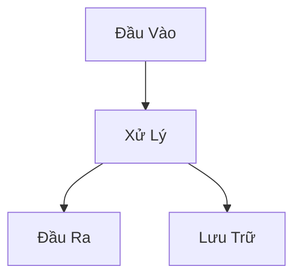

# Student Workflow Guide - Tăng Tốc Làm Bài Với AI

| Version | Date | Author | Description |
| --- | --- | --- | --- |
| 1.0.0 | 2026-01-15 | Elix Team | Complete workflow for students |

## Table of Contents

1. [Tổng Quan](#1-tổng-quan)
2. [Chuẩn Bị Môi Trường](#2-chuẩn-bị-môi-trường)
3. [Workflow 5 Bước](#3-workflow-5-bước)
4. [Mẹo Tăng Tốc](#4-mẹo-tăng-tốc)
5. [Lỗi Thường Gặp](#5-lỗi-thường-gặp)

---

## 1. Tổng Quan

### Tại Sao Cách Này Nhanh Hơn?

| Cách Truyền Thống | Cách Mới (VS Code + AI) |
| --- | --- |
| Mở Word, nghĩ nội dung, căn lề, chọn font | Viết Markdown, AI hỗ trợ, export tự động |
| Làm slide riêng, copy nội dung từ báo cáo | 1 file Markdown → cả báo cáo lẫn slide |
| Sửa báo cáo xong phải sửa lại slide | Sửa 1 lần, cả 2 output cập nhật |

### Ai Có Thể Áp Dụng?

- Học sinh THPT
- Sinh viên đại học
- Bất kỳ ai biết gõ tiếng Việt và cài phần mềm

**Không cần biết lập trình. Chỉ cần làm theo hướng dẫn.**

---

## 2. Chuẩn Bị Môi Trường

### Bước 1: Cài VS Code

1. Tải VS Code tại: https://code.visualstudio.com/
2. Cài đặt như phần mềm bình thường

### Bước 2: Cài Extensions Cần Thiết

Mở VS Code, nhấn `Ctrl+Shift+X`, tìm và cài:

| Extension | Tác Dụng |
| --- | --- |
| **Marp for VS Code** | Tạo slide từ Markdown |
| **GitHub Copilot** | AI hỗ trợ viết |
| **Markdown PDF** | Export ra PDF |
| **Markdown Preview Mermaid** | Vẽ sơ đồ |

### Bước 3: Tạo Thư Mục Làm Việc

```
bai_thuyet_trinh/
├── noi_dung.md          # File chính
├── hinh_anh/            # Thư mục ảnh
└── output/              # File xuất ra
```

---

## 3. Workflow 5 Bước

### Bước 1: SKELETON - Dựng Khung (2-3 phút)

**Mục tiêu**: Tạo cấu trúc heading trước khi viết nội dung.

```markdown
# Đề Tài: [Tên đề tài]

## 1. Giới Thiệu
### 1.1. Bối Cảnh
### 1.2. Mục Tiêu

## 2. Nội Dung Chính
### 2.1. Khái Niệm
### 2.2. Phương Pháp
### 2.3. Kết Quả

## 3. Kết Luận

## 4. Tài Liệu Tham Khảo
```

**Lưu ý**: Skeleton quyết định 80% chất lượng bài. Dành thời gian suy nghĩ ở bước này.

### Bước 2: ANCHOR - Viết Câu Mở Đầu (5-10 phút)

**Mục tiêu**: Mỗi section có 1 câu định hướng để AI hiểu context.

```markdown
## 2. Nội Dung Chính

### 2.1. Khái Niệm

Trí tuệ nhân tạo (AI) là khả năng của máy tính mô phỏng trí thông minh con người.

### 2.2. Phương Pháp

Nghiên cứu này sử dụng phương pháp phân tích tài liệu kết hợp khảo sát thực tế.
```

**Sau khi viết câu anchor, Copilot sẽ tự động gợi ý nội dung tiếp theo.**

### Bước 3: EXPAND - Để AI Mở Rộng (10-15 phút)

**Cách sử dụng Copilot hiệu quả**:

1. Đặt con trỏ cuối câu anchor
2. Nhấn `Enter` và đợi Copilot gợi ý
3. Nhấn `Tab` để chấp nhận, `Esc` để bỏ qua

**Ví dụ**:

Bạn viết:
```markdown
### 2.1. Các Ứng Dụng của AI

AI được ứng dụng rộng rãi trong nhiều lĩnh vực:
```

Copilot sẽ gợi ý:
```markdown
- **Y tế**: Chẩn đoán bệnh, phân tích hình ảnh y khoa
- **Giáo dục**: Hệ thống học tập thông minh, đánh giá tự động
- **Tài chính**: Phát hiện gian lận, dự đoán thị trường
- **Giao thông**: Xe tự hành, tối ưu hóa lộ trình
```

### Bước 4: REVIEW - Đọc Lại và Chỉnh Sửa (5-10 phút)

**Checklist kiểm tra**:

- [ ] Đọc to mỗi section - có hiểu không?
- [ ] Xóa những đoạn dài dòng, không cần thiết
- [ ] Kiểm tra logic: A dẫn đến B có hợp lý không?
- [ ] Thêm ví dụ cụ thể nếu quá trừu tượng
- [ ] Kiểm tra chính tả và ngữ pháp

**Quy tắc vàng**: Nếu bạn không thể giải thích đoạn văn bằng lời nói, hãy viết lại.

### Bước 5: EXPORT - Xuất File (1-2 phút)

**Export Slide (Marp)**:

1. Thêm header Marp vào đầu file:

```markdown
---
marp: true
theme: default
paginate: true
---
```

2. Thêm `---` để ngắt slide:

```markdown
---

# Slide 1: Giới Thiệu

- Điểm 1
- Điểm 2

---

# Slide 2: Nội Dung

- Chi tiết A
- Chi tiết B
```

3. Nhấn `Ctrl+Shift+P` → "Marp: Export Slide Deck"

**Export PDF Report**:

1. Nhấn `Ctrl+Shift+P` → "Markdown PDF: Export (pdf)"

---

## 4. Mẹo Tăng Tốc

### 4.1. Comment Để Điều Khiển AI

```markdown
<!-- Viết 3 bullet points về lợi ích của AI trong giáo dục -->

-
```

Copilot sẽ đọc comment và gợi ý theo yêu cầu.

### 4.2. Dùng Template Có Sẵn

Copy template từ thư mục `templates/` thay vì bắt đầu từ file trống.

### 4.3. Keyboard Shortcuts

| Phím | Tác Dụng |
| --- | --- |
| `Tab` | Chấp nhận gợi ý Copilot |
| `Esc` | Bỏ qua gợi ý |
| `Ctrl+Enter` | Xem nhiều gợi ý khác |
| `Ctrl+Shift+V` | Preview Markdown |
| `Ctrl+K V` | Preview bên cạnh |

### 4.4. Vẽ Sơ Đồ Bằng Mermaid

Thay vì vẽ tay hoặc dùng PowerPoint:

```markdown

```

---

## 5. Lỗi Thường Gặp

### Lỗi 1: Viết Quá Nhiều Mà Rỗng

**Triệu chứng**: Bài dài nhưng không có ý chính.

**Cách sửa**: Sau mỗi đoạn, tự hỏi "Đoạn này trả lời câu hỏi gì?"

### Lỗi 2: Tin AI 100%

**Triệu chứng**: Copy nguyên gợi ý không đọc lại.

**Cách sửa**: Luôn đọc lại và edit. AI có thể sai số liệu, sai logic.

### Lỗi 3: Không Có Cấu Trúc

**Triệu chứng**: Viết liên tục không có heading.

**Cách sửa**: Quay lại Bước 1, làm skeleton trước.

### Lỗi 4: Slide Quá Nhiều Chữ

**Triệu chứng**: Copy nguyên đoạn văn vào slide.

**Cách sửa**: 
- Slide chỉ có keywords
- Chi tiết để trong speaker notes

```markdown
# Lợi Ích AI

- Tự động hóa
- Chính xác cao
- Tiết kiệm thời gian

<!-- 
Speaker notes: 
Giải thích chi tiết từng điểm khi thuyết trình.
Tự động hóa giúp giảm 60% thời gian làm việc thủ công...
-->
```

---

## Tổng Kết

| Bước | Thời Gian | Output |
| --- | --- | --- |
| 1. Skeleton | 2-3 phút | Cấu trúc heading |
| 2. Anchor | 5-10 phút | Câu định hướng |
| 3. Expand | 10-15 phút | Nội dung đầy đủ |
| 4. Review | 5-10 phút | Bài hoàn chỉnh |
| 5. Export | 1-2 phút | PDF/Slide |

**Tổng: 25-40 phút** cho một bài thuyết trình cơ bản.

So với cách truyền thống (2-3 giờ), tiết kiệm **70-80% thời gian**.

---

## Bước Tiếp Theo

1. Đọc [Quick Start Guide](quick_start.md) để bắt đầu ngay
2. Xem [Template Examples](../examples/) để có ý tưởng
3. Thử làm 1 bài thuyết trình nhỏ theo workflow này
