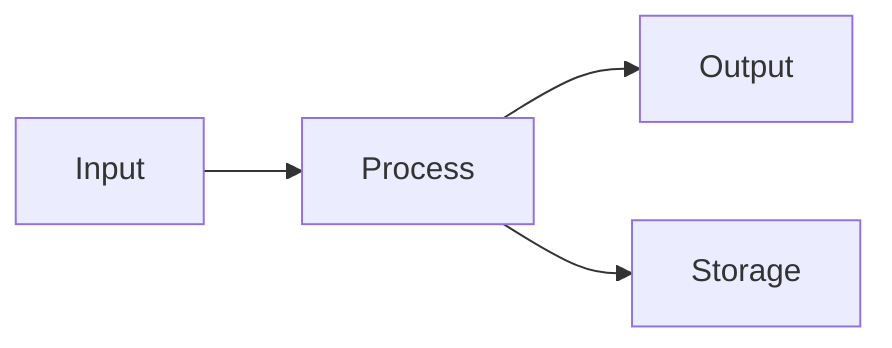

<!-- _class: lead -->

# Example Presentation

## Subtitle Goes Here

**Author Name**
Organization / School
Date: 2026-01-15

---

# Agenda

1. Introduction
2. Main Content
3. Results
4. Conclusion
5. Q&A

<!--
Speaker notes:
- Welcome everyone
- Brief overview of what we'll cover
- Expected time: 15 minutes
-->

---

# 1. Introduction

## Background

- Point A: Description of the context
- Point B: Why this topic matters
- Point C: Current challenges

<!--
Speaker notes:
Explain the background in more detail.
Use real examples if possible.
-->

---

# 1. Introduction

## Objectives

Our main goals:

1. **Primary**: Achieve X
2. **Secondary**: Improve Y
3. **Tertiary**: Explore Z

---

# 2. Main Content

## Key Concept A

- Definition
- Importance
- Application

```python
# Example code
def process_data(data):
    return data.transform()
```

---

# 2. Main Content

## Key Concept B

| Feature | Option 1 | Option 2 |
| --- | --- | --- |
| Speed | Fast | Medium |
| Cost | High | Low |
| Quality | Excellent | Good |

---

# 2. Main Content

## Architecture Overview



---

# 3. Results

## Performance Metrics

- Accuracy: **95%**
- Speed: **2x faster**
- Cost: **30% reduction**

---

# 3. Results

## Comparison


- Our method outperforms baseline
- Significant improvement in key metrics
- Consistent results across tests

---

# 4. Conclusion

## Summary

- Achieved objective X
- Demonstrated improvement in Y
- Opened possibilities for Z

## Next Steps

1. Further testing
2. Scale deployment
3. Gather feedback

---

<!-- _class: lead -->

# Thank You

## Questions?

Contact: author@email.com
GitHub: github.com/author

---

# Appendix

## Additional Resources

- Documentation: [link]
- Source Code: [link]
- References: See handout
