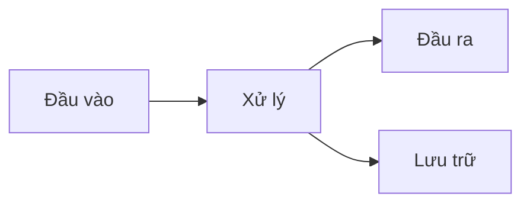

<!-- _class: lead -->

# Tiêu Đề Bài Thuyết Trình

## Tiêu đề phụ (nếu có)

**Họ và tên**: [Tên của bạn]
**Lớp / Môn học**: [Thông tin]
**Ngày**: [DD/MM/YYYY]

---

# Mục Lục

1. Giới thiệu
2. Nội dung chính
3. Kết luận
4. Q&A

<!-- 
Speaker notes:
- Giới thiệu nhanh cấu trúc bài
- Ước lượng thời gian mỗi phần
-->

---

# 1. Giới Thiệu

## Bối cảnh

- Điểm quan trọng 1
- Điểm quan trọng 2
- Điểm quan trọng 3

<!-- 
Speaker notes:
Giải thích chi tiết bối cảnh tại đây.
Nhấn mạnh tại sao đề tài này quan trọng.
-->

---

# 1. Giới Thiệu

## Mục tiêu

- Mục tiêu 1: [Mô tả]
- Mục tiêu 2: [Mô tả]
- Mục tiêu 3: [Mô tả]

---

# 2. Nội Dung Chính

## 2.1. Khái Niệm Cơ Bản

- Định nghĩa A
- Định nghĩa B
- Mối quan hệ giữa A và B

<!-- 
Speaker notes:
Bắt đầu từ khái niệm đơn giản nhất.
Đảm bảo audience hiểu trước khi đi sâu.
-->

---

# 2. Nội Dung Chính

## 2.2. Phân Tích Chi Tiết

| Tiêu chí | Phương án A | Phương án B |
| --- | --- | --- |
| Ưu điểm | ... | ... |
| Nhược điểm | ... | ... |
| Chi phí | ... | ... |

---

# 2. Nội Dung Chính

## 2.3. Minh Họa

<!-- 
Speaker notes:
Giải thích flow từng bước.
Đây là phần quan trọng cần pause để giải thích.
-->

---

# 3. Kết Luận

## Tóm tắt

- Điểm chính 1: [Nội dung]
- Điểm chính 2: [Nội dung]
- Điểm chính 3: [Nội dung]

## Hướng phát triển

- Bước tiếp theo 1
- Bước tiếp theo 2

---

<!-- _class: lead -->

# Cảm Ơn Đã Lắng Nghe

## Q&A

Liên hệ: [email@example.com]

---

# Tài Liệu Tham Khảo

1. Tác giả A. (Năm). *Tên sách*. Nhà xuất bản.
2. Tác giả B. (Năm). Tên bài báo. *Tên tạp chí*, số(tập), trang.
3. Website. URL: https://example.com
