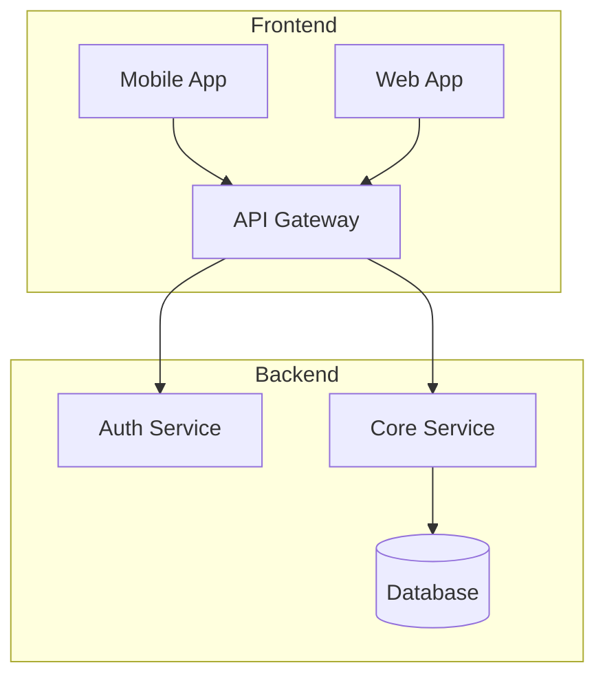

<style>
section {
  background: linear-gradient(135deg, #1a1a2e 0%, #16213e 100%);
}
h1 {
  color: #e94560;
}
h2 {
  color: #0f3460;
  background: #e94560;
  padding: 5px 15px;
  border-radius: 5px;
  display: inline-block;
}
code {
  background: #0f3460;
  padding: 2px 8px;
  border-radius: 4px;
}
</style>

<!-- _class: lead -->

# Tên Đồ Án Kỹ Thuật

## Technical Project Presentation

**Team**: [Tên nhóm]
**Members**: Thành viên 1, Thành viên 2, Thành viên 3
**Date**: [DD/MM/YYYY]

---

# Agenda

1. Problem Statement
2. System Architecture
3. Implementation
4. Demo
5. Results & Evaluation
6. Conclusion

---

# Problem Statement

## What We're Solving

- **Problem**: [Mô tả vấn đề]
- **Impact**: [Ai bị ảnh hưởng, mức độ]
- **Current Solutions**: [Giải pháp hiện có và hạn chế]

<!-- 
Speaker notes:
Bắt đầu bằng việc khiến audience quan tâm đến vấn đề.
Dùng số liệu cụ thể nếu có.
-->

---

# System Architecture

## High-Level Overview



---

# Technology Stack

| Layer | Technology | Reason |
| --- | --- | --- |
| Frontend | React / Flutter | Cross-platform |
| Backend | FastAPI / Node.js | High performance |
| Database | PostgreSQL | ACID compliance |
| Deployment | Docker + K8s | Scalability |

---

# Implementation

## Key Feature 1: [Tên Feature]

```python
# Sample code snippet
async def process_data(input: DataModel) -> Result:
    validated = await validate(input)
    result = await core_logic(validated)
    return Result(data=result, status="success")
```

---

# Implementation

## Key Feature 2: [Tên Feature]

- Component A: [Mô tả]
- Component B: [Mô tả]
- Integration: [Cách chúng kết nối]

---

# Demo

## Live Demonstration

<!-- Chèn screenshot hoặc GIF ở đây -->


<!-- 
Speaker notes:
Chuẩn bị demo offline phòng trường hợp mất mạng.
Có backup video nếu cần.
-->

---

# Results & Evaluation

## Performance Metrics

| Metric | Target | Achieved |
| --- | --- | --- |
| Response Time | < 200ms | 150ms |
| Accuracy | > 90% | 94.5% |
| Uptime | 99.9% | 99.95% |

---

# Results & Evaluation

## Comparison

```mermaid
bar
    title Performance Comparison
    "Our Solution" : 94
    "Baseline A" : 78
    "Baseline B" : 82
```

---

# Lessons Learned

## What Worked

- Modular architecture
- Early testing
- Regular code reviews

## Challenges

- Integration complexity
- Performance optimization
- Time constraints

---

# Conclusion

## Summary

- Successfully implemented [core feature]
- Achieved [key metric] improvement
- Demonstrated [value proposition]

## Future Work

- Feature X enhancement
- Scale to Y users
- Integration with Z

---

<!-- _class: lead -->

# Thank You

## Questions?

GitHub: [repo-link]
Demo: [demo-link]
Contact: [email]
