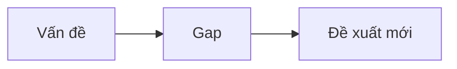
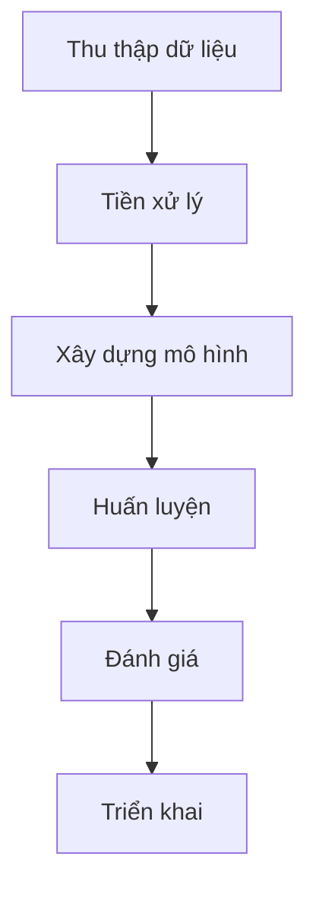
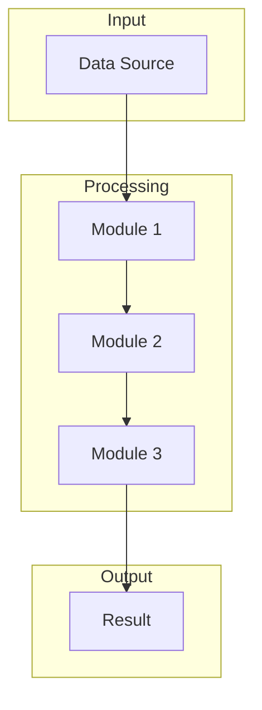

<!-- _class: lead -->

# [Tên Đề Tài]

## Báo Cáo Đồ Án Tốt Nghiệp / Luận Văn

**Sinh viên**: [Họ và tên] - [MSSV]
**Giảng viên hướng dẫn**: [Họ và tên GV]
**Khoa**: [Tên khoa]
**Trường**: [Tên trường]
**Năm**: [YYYY]

---

# Nội Dung Trình Bày

1. Đặt vấn đề và mục tiêu
2. Cơ sở lý thuyết
3. Phương pháp nghiên cứu
4. Thiết kế và triển khai
5. Kết quả thực nghiệm
6. Kết luận và hướng phát triển

---

# 1. Đặt Vấn Đề

## Bối Cảnh

- [Mô tả bối cảnh thực tế]
- [Thống kê/số liệu liên quan]
- [Xu hướng hiện tại]

## Vấn Đề Cần Giải Quyết

- [Vấn đề cụ thể 1]
- [Vấn đề cụ thể 2]

---

# 1. Đặt Vấn Đề

## Mục Tiêu Nghiên Cứu

### Mục tiêu tổng quát
[Mô tả mục tiêu chính]

### Mục tiêu cụ thể
1. [Mục tiêu 1]
2. [Mục tiêu 2]
3. [Mục tiêu 3]

---

# 1. Đặt Vấn Đề

## Phạm Vi Nghiên Cứu

- **Đối tượng**: [Đối tượng nghiên cứu]
- **Phạm vi**: [Giới hạn không gian, thời gian]
- **Giới hạn**: [Những gì không nằm trong phạm vi]

---

# 2. Cơ Sở Lý Thuyết

## Các Khái Niệm Cơ Bản

### [Khái niệm A]
[Định nghĩa ngắn gọn]

### [Khái niệm B]
[Định nghĩa ngắn gọn]

---

# 2. Cơ Sở Lý Thuyết

## Các Nghiên Cứu Liên Quan

| Tác giả | Năm | Phương pháp | Kết quả | Hạn chế |
| --- | --- | --- | --- | --- |
| [A] | 20XX | ... | ... | ... |
| [B] | 20XX | ... | ... | ... |
| [C] | 20XX | ... | ... | ... |

---

# 2. Cơ Sở Lý Thuyết

## Khoảng Trống Nghiên Cứu

- Nghiên cứu trước chưa giải quyết: [...]
- Đề xuất của đồ án này: [...]



---

# 3. Phương Pháp Nghiên Cứu

## Quy Trình Tổng Quan



---

# 3. Phương Pháp Nghiên Cứu

## Thu Thập Dữ Liệu

- **Nguồn dữ liệu**: [Mô tả nguồn]
- **Số lượng**: [Kích thước dataset]
- **Đặc điểm**: [Các thuộc tính chính]

---

# 3. Phương Pháp Nghiên Cứu

## Phương Pháp Đề Xuất

[Mô tả phương pháp/thuật toán/mô hình được sử dụng]

**Ưu điểm so với phương pháp hiện có:**
- [Ưu điểm 1]
- [Ưu điểm 2]

---

# 4. Thiết Kế và Triển Khai

## Kiến Trúc Hệ Thống



---

# 4. Thiết Kế và Triển Khai

## Công Nghệ Sử Dụng

| Thành phần | Công nghệ | Phiên bản |
| --- | --- | --- |
| Ngôn ngữ | Python | 3.10 |
| Framework | [Framework] | x.x |
| Database | [DB] | x.x |
| Deployment | [Platform] | - |

---

# 4. Thiết Kế và Triển Khai

## Giao Diện Hệ Thống

<!-- Chèn screenshot -->


---

# 5. Kết Quả Thực Nghiệm

## Môi Trường Thực Nghiệm

- **Hardware**: [CPU, RAM, GPU]
- **Software**: [OS, Libraries]
- **Dataset**: [Train/Test split]

---

# 5. Kết Quả Thực Nghiệm

## Kết Quả Định Lượng

| Metric | Baseline | Proposed | Improvement |
| --- | --- | --- | --- |
| Accuracy | 85% | 92% | +7% |
| F1-Score | 0.82 | 0.91 | +0.09 |
| Time | 2.5s | 1.8s | -28% |

---

# 5. Kết Quả Thực Nghiệm

## So Sánh Với Các Phương Pháp Khác

```mermaid
bar
    title Accuracy Comparison
    "Proposed" : 92
    "Method A" : 85
    "Method B" : 88
    "Method C" : 79
```

---

# 5. Kết Quả Thực Nghiệm

## Phân Tích Kết Quả

### Điểm mạnh
- [Điểm mạnh 1]
- [Điểm mạnh 2]

### Hạn chế
- [Hạn chế 1]
- [Hạn chế 2]

---

# 6. Kết Luận

## Đóng Góp Chính

1. **Về mặt lý thuyết**: [Đóng góp]
2. **Về mặt thực tiễn**: [Đóng góp]
3. **Về mặt kỹ thuật**: [Đóng góp]

---

# 6. Kết Luận

## Hướng Phát Triển

- **Ngắn hạn**: [Kế hoạch 1-3 tháng]
- **Trung hạn**: [Kế hoạch 6-12 tháng]
- **Dài hạn**: [Tầm nhìn]

---

<!-- _class: lead -->

# Cảm Ơn Quý Thầy/Cô và Các Bạn Đã Lắng Nghe

## Hỏi Đáp

**Sinh viên**: [Họ và tên]
**Email**: [email@example.com]

---

# Tài Liệu Tham Khảo

1. [Tác giả]. ([Năm]). *[Tên công trình]*. [Nguồn].
2. [Tác giả]. ([Năm]). [Tên bài báo]. *[Tên tạp chí]*, [số(tập)], [trang].
3. [Tác giả]. ([Năm]). [Tên sách]. [Nhà xuất bản].

---

# Phụ Lục

## Demo Video / Screenshots Bổ Sung

<!-- Thêm nội dung phụ lục nếu cần -->
